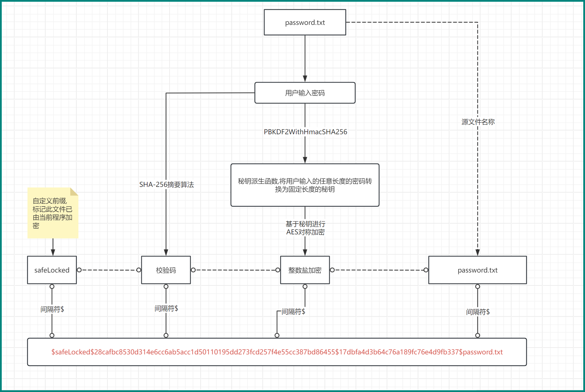

<h1 align="center" style="color:rgb(0,133,125)">dororo-crypto</h1>

<div align="center" style="color: rgb(0,133,125);font-style: italic;"><span>纵有疾风起：Even as the gale arises</span></div>

# 加解密原理

利用Java中IO流读取字节时,每个字节都可以转化为一个整数,在此基础上，定义一个随机但确定的整数作为盐值（当前系统从1~3000中随机取，也可以定义其他范围），加密时加上此盐值实现加密,解密时减去同样的盐值实现解密。关键代码片段：

```java
// 读取源文件的输入流,写入到临时文件的输出流
while ((len = cryptoContext.getBis().read(buffer)) != -1) {
    // 此处已经将字节读取到缓冲区,不能在此缓冲区中直接修改,
    // 应该用一个新的字节数组来接收加盐后的字节,定义临时缓冲区副本
    byte[] newBuffer = new byte[len];
    // 对每个字节加减整数盐后重新收集:(1)加密时,增加整数盐;(2)解密时,减去整数盐
    for (int i = 0; i < len; i++) {
        newBuffer[i] = (byte) (buffer[i] + (cryptoContext.getAskEncrypt() ? intSalt : -intSalt));
    }
    // 加盐后的字节写入到临时文件的输出流
    cryptoContext.getBos().write(newBuffer);
    // 省略     
}
```


# 文件名存储加密信息




## 需求

将加密信息记录在文件名,无其他任何辅助记事本,且密码无法破解。

## 问题

如何确保“无法通过加密后的文件公开的内容”反推密码？


## 解决思路

在加解密整个声明周期中，只有用户输入的密码是其他人无法得知的。

1.利用`用户输入的密码`转化为定长秘钥，对整数盐进行对称加密,由于破解者无法知道`用户输入的密码`,且也是基于SHA-256加密，破解难度几乎不可能,因此保证盐值的安全，`用户输入的密码`是不定长度的，破解的难度再增加一个维度；

2.`用户输入的密码`直接使用SHA-256摘要算法加密得到比对文,同样无法逆向。

3.系统接收到用户临时输入的密码后，与摘要算法校验码进行比对，比对正确说明用户本次输入的是正确的密码，那么用此密码对整数盐进行解密，得到的才是正确的盐值。

